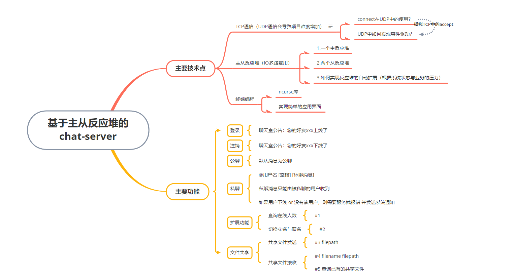
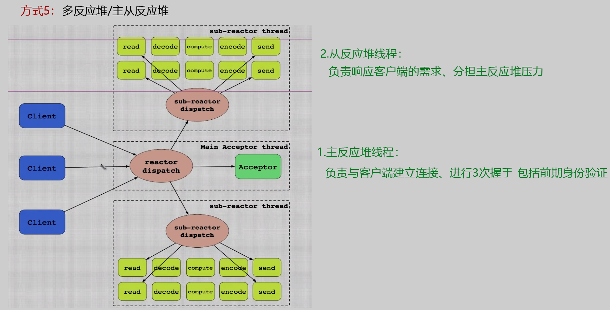
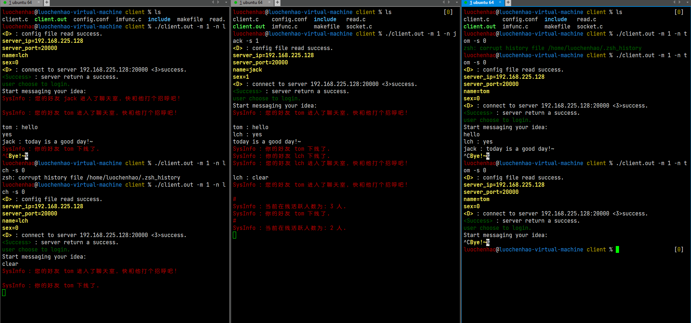

# chat-server

---

一个基于主从反应堆的chat-server，有较为完整的Git记录便于学习

- 服务端：主从反应堆模型、IO多路复用epoll、TCP通信、
- 客户端：ncurse库实现简单的终端界面，
- 主要功能：



- 主从反应堆结构：



- 聊天测试：



```cpp
.
├── doc/assets
│   ├── image-20230403154140732.png
│   └── wechat.xmind
├── client
│   ├── client.c
│   ├── imfunc.c
│   ├── include
│   │   ├── color.h
│   │   ├── head.h
│   │   ├── imfunc.h
│   │   ├── info.h
│   │   ├── read.h
│   │   └── socket.h
│   ├── makefile
│   ├── read.c
│   ├── socket.c
│   └── wechat.conf
├── README.md
├── server
│   ├── imfunc.c
│   ├── include
│   │   ├── color.h
│   │   ├── head.h
│   │   ├── imfunc.h
│   │   ├── info.h
│   │   ├── read.h
│   │   ├── socket.h
│   │   ├── sub_reactor.h
│   │   └── thread_pool.h
│   ├── makefile
│   ├── read.c
│   ├── server.c
│   ├── socket.c
│   ├── sub_reactor.c
│   ├── thread_pool.c
│   └── wechatd.conf
└── ui
    ├── ui.c
    └── ui.h
```


