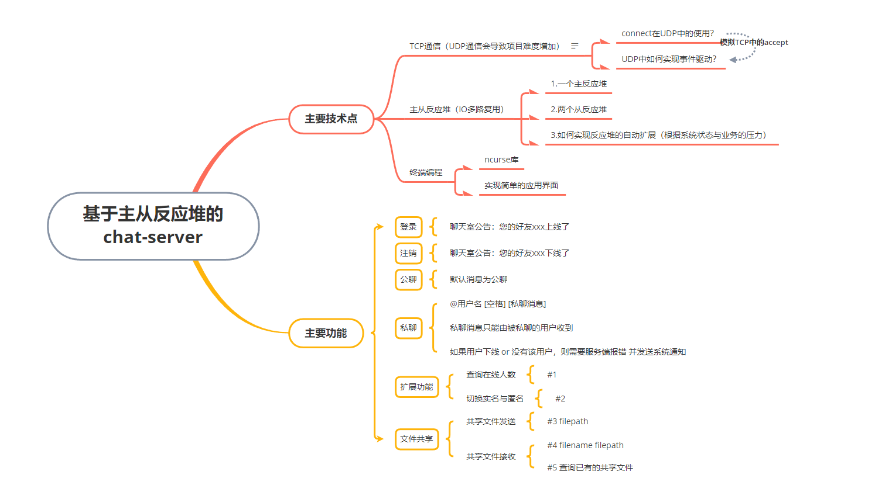

# chat-server

---

一个基于主从反应堆的chat-server，有较为完整的commit记录便于学习

- 服务端：主从反应堆模型、IO多路复用epoll、TCP通信、
- 客户端：ncurse库实现简单的终端界面（废弃），

- 主从反应堆结构：


C语言实现的聊天室，主要采用主从反应堆的设计来实现，

1. 主反应堆负责与客户端建立连接、进行用户的登录与注册（未实现没有接入数据库）

2. 从反应堆负责响应客户端 的其他需要，从而分担主反应堆的压力，

3. 引入线程池进一步提高性能，

    - 什么时候用线程池：当IO事务并发较高时，需要引入线程池，以降低资源消耗（与数据库连接池类似、降低申请与销毁线程的资源消耗）

    - 线程的数量要多少合适：与CPU核心数量相匹配

    - 如何实现线程池：

        ```c
        struct task_queue {
        	int head, tail;
        	int size;				//队列容量
        	int count;				//已经入队的元素
        	void **data;			//模拟任务
        	pthread_mutex_t mutex;	//需要互斥锁加锁
        	pthread_cond_t cond;	//信号量
        };
        
        void task_queue_init(struct task_queue *taskQueue, int size);	//队列初始化
        void task_queue_push(struct task_queue *taskQueue, void *data);	//入队
        void *task_queue_pop(struct task_queue *taskQueue);				//出队
        
        void *thread_run(void *arg);									//线程处理函数
        ```

        ```c
        // 初始化任务队列 传入队列的指针 taskQueue 和队列的大小 size
        void task_queue_init(struct task_queue *taskQueue, int size) {
        	// 设置队列大小、计数、头尾指针等参数 并分配一定大小的内存用于存储队列数据
        	taskQueue->size = size;
        	taskQueue->count = taskQueue->head = taskQueue->tail = 0;
        	taskQueue->data = calloc(size, sizeof(void *));
        	// 初始化互斥锁 mutex 和条件变量 cond 用于线程同步
        	pthread_mutex_init(&taskQueue->mutex, NULL);
        	pthread_cond_init(&taskQueue->cond, NULL);
        	return;
        }
        
        // 将数据推送到任务队列中
        void task_queue_push(struct task_queue *taskQueue, void *data) {
        	// 为了保证线程的安全性 所有对临界区的操作都需要加锁
        	pthread_mutex_lock(&taskQueue->mutex);					//使用互斥锁 mutex 来保护对队列的并发访问
        	if (taskQueue->count == taskQueue->size) {				//如果队列已满则释放锁，如果不释放锁将导致死锁
        		DBG(YELLOW"<push> : taskQueue is full\n"NONE);
        		pthread_mutex_unlock(&taskQueue->mutex);
        		return;
        	}
        	taskQueue->data[taskQueue->tail] = data;
        	DBG(GREEN"<push> : data is pushed!\n"NONE);
        	taskQueue->tail++;										//更新队列的尾指针、计数，并在必要时考虑循环队列
        	taskQueue->count++;
        	// 考虑循环队列
        	if (taskQueue->tail == taskQueue->size) {
        		DBG(YELLOW"<push> : taskQueue tail reach end!\n"NONE);
        		taskQueue->tail = 0;
        	}
        	pthread_cond_signal(&taskQueue->cond);					//发送条件变量信号 通知可能在等待任务的线程
        	pthread_mutex_unlock(&taskQueue->mutex);				//释放互斥锁
        	return;
        }
        
        // 从任务队列中弹出数据 传入队列指针 taskQueue
        void *task_queue_pop(struct task_queue *taskQueue) {
        	pthread_mutex_lock(&taskQueue->mutex);					//使用互斥锁 mutex 来保护对队列的并发访问
        	//使用while循环而不是if语句 处理惊群效应
        	while (taskQueue->count == 0) {
        		/* 当任务队列中没有任务时 线程选择等待而不是直接return
        		1.如果让线程直接返回则意味着一会还需要让线程轮训回来（轮询时间有要求）
        		2.轮询时间太短则消耗CPU
        		3.轮询时间太长则相应能力下降
        		 */
        		//cond与mutex同时使用
        		pthread_cond_wait(&taskQueue->cond, &taskQueue->mutex);
        	}
        	void *data = taskQueue->data[taskQueue->head];			//当队列不为空时，从队列的头部获取数据，更新队列头指针、计数，并在必要时考虑循环队列
        	DBG(RED"<pop> : data is poped!\n"NONE);
        	taskQueue->count--;
        	taskQueue->head++;
        	/* 考虑循环队列 */
        	if (taskQueue->head == taskQueue->size) {
        		DBG(YELLOW"<pop> : taskQueue head reach end!\n"NONE);
        		taskQueue->head = 0;
        	}
        	pthread_mutex_unlock(&taskQueue->mutex);				//最后释放互斥锁，并返回弹出的数据指针
        	return data;
        }
        ```

    - 惊群效应解决：使用while循环而不是if语句 处理惊群效应

4. 实现了简单的私聊消息、群聊消息、查看在线人数等基本功能（在服务器内存中维护了一个结构体数组`users`，用sockfd作为数组下标来进行引用），

5. 利用服务端定时给客户端发送心跳包利用，`setitimer`每隔10秒释放一次信号，或者也可以单独开一个线程来实现，

- 聊天测试：


- 主要架构图：




